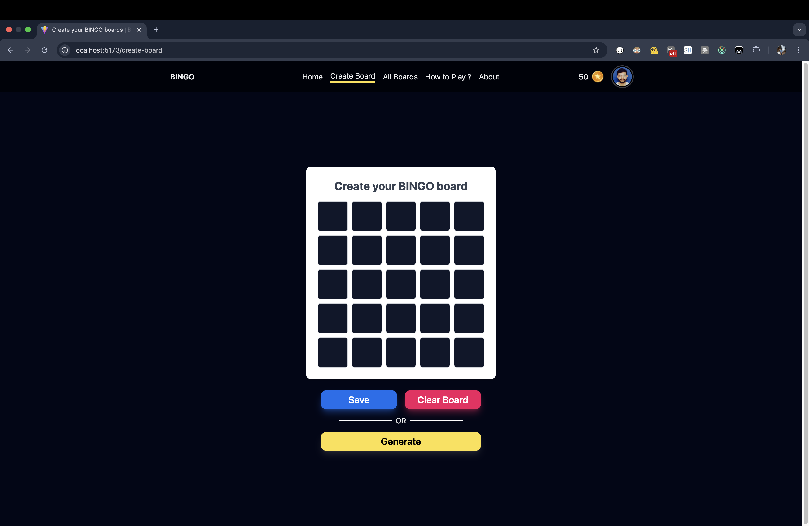
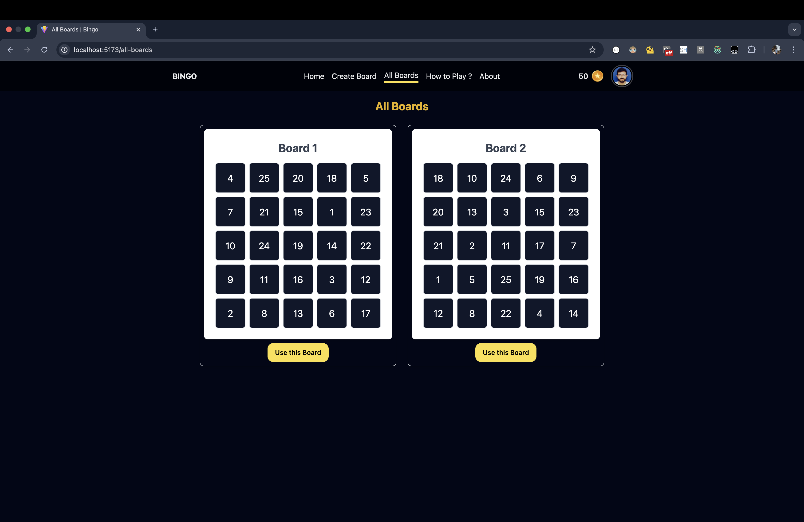
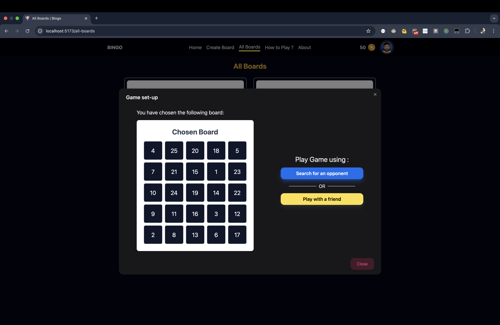
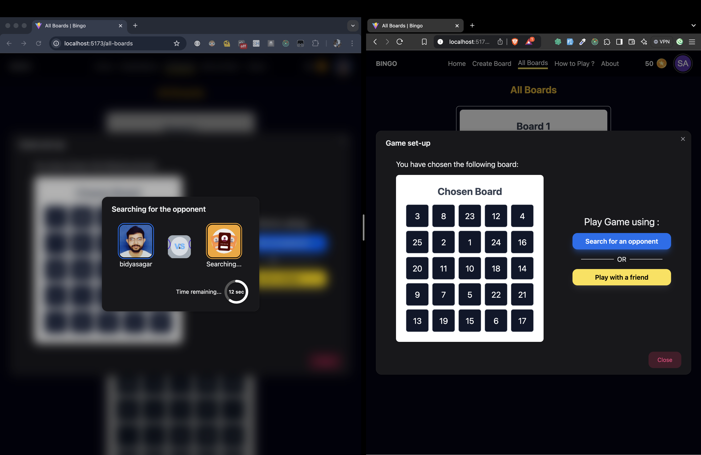
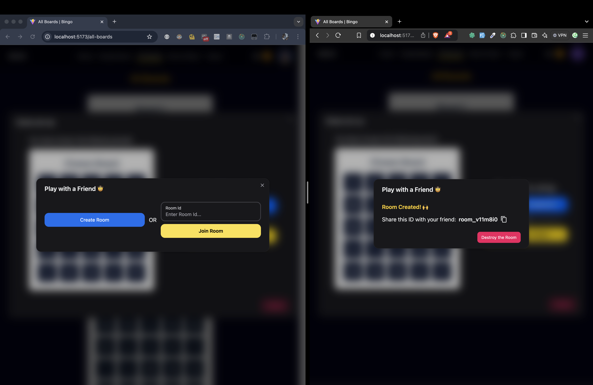
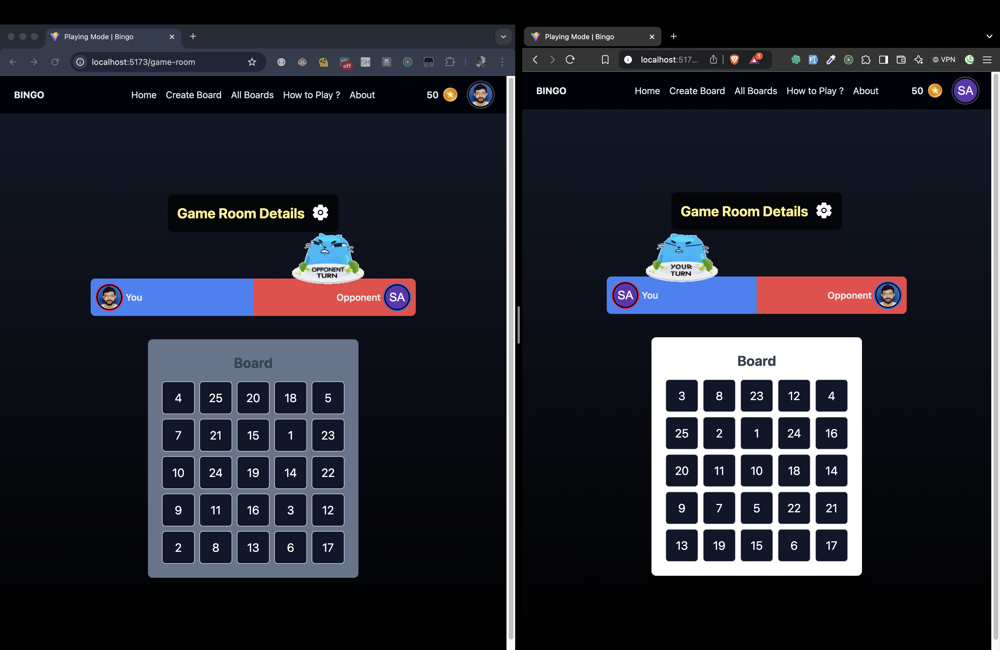
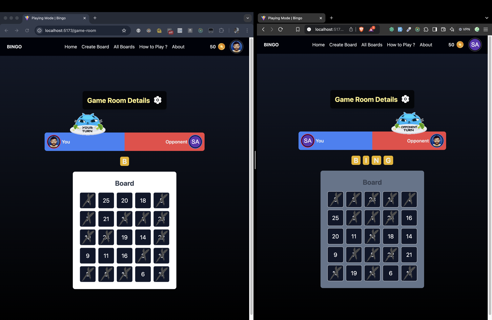
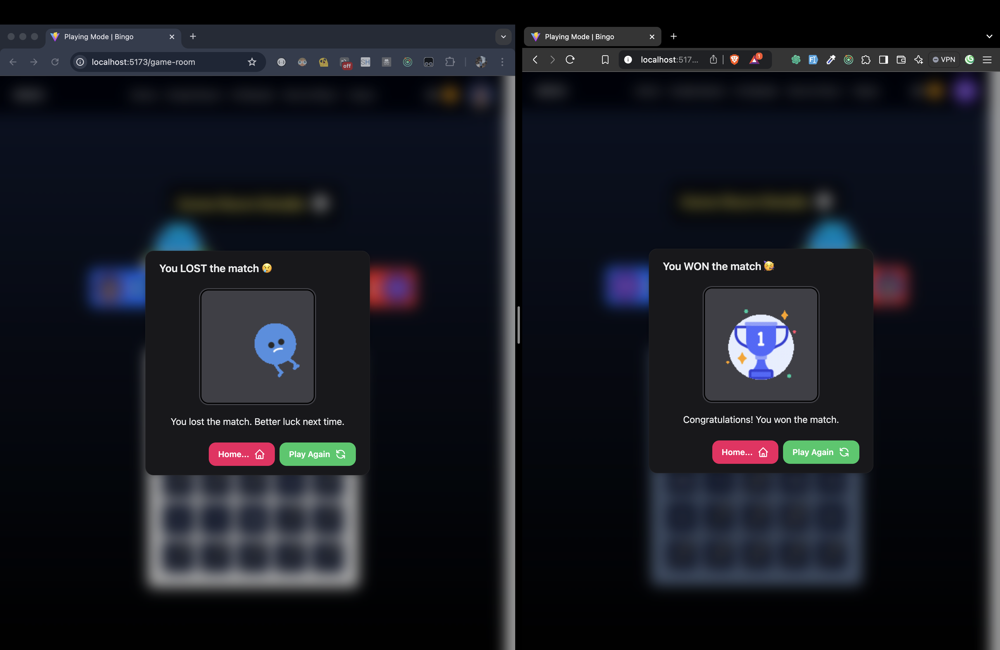
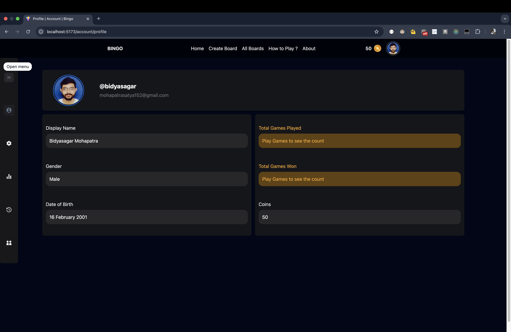
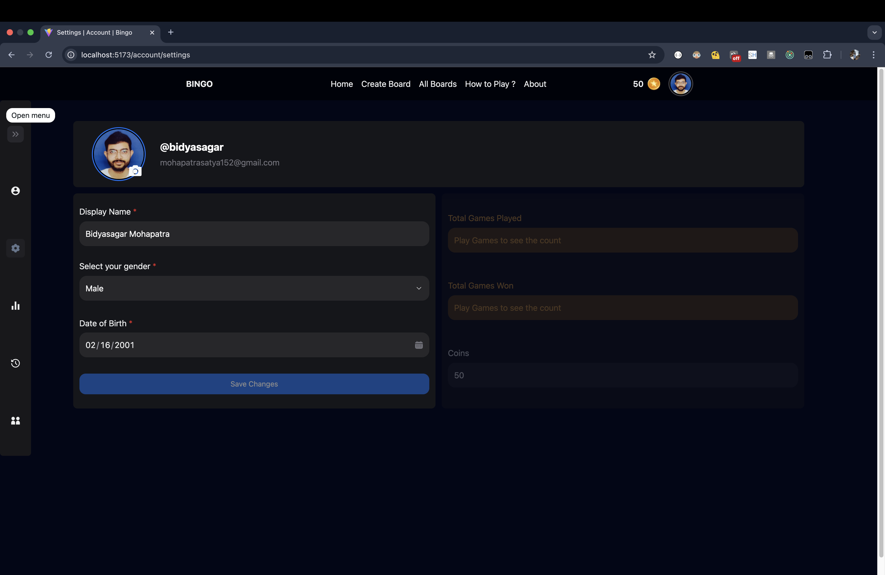

# Bingo Game 🎮

Welcome to the Bingo Game! This is a web-based multiplayer game where players can enjoy the classic Bingo experience online. Create custom boards, play with friends, and enjoy exciting features with more updates coming soon!

---

## Features

### Completed Features
1. **Sign Up**
   - Create a new account to join the Bingo platform.

2. **Login**
   - Secure authentication to access your Bingo profile.

3. **Create Bingo Boards (Or Generate)**
   - Customise your Bingo board manually or generate one randomly.

4. **Choose Any Board for Play**
   - Select from your created boards to use during the game.

5. **Game Options**
   - Play with others in two exciting modes:
     - **Search for Opponent**: Match with a random opponent.
     - **Play with a Friend**: Invite and play with your friends.

6. **Multiplayer Gameplay**
   - Real-time gameplay with an opponent to keep the fun alive.

7. **Account Section**
   - Manage your profile and view personal details.

8. **Settings Section**
   - Customise your game experience with various settings.
     
9. **Game History**
   - Review past games and analyse your gameplay.

---

### Upcoming Features

1. **View Statistics of Your Game**
   - Track your wins, losses, and other performance metrics.

2. **Send Friend Requests and Accept (with Real-Time Notifications)**
   - Add friends and get notified when they accept your requests.

3. **Chat with Friends**
   - Communicate with your friends directly on the platform.

4. **Earn Coins and Use Them to Create Boards**
   - Earn in-game currency by playing and use it to unlock new features.

5. **And Many More...**
   - Stay tuned for more exciting updates and features!

---

## Technologies Used

- **Frontend**: React.js, Redux Toolkit
- **Backend**: Node.js, Express.js
- **Database**: MongoDB
- **WebSocket**: Socket.io
- **Styling**: Tailwind CSS, Hero UI (Next UI)
> and many libraries

---

## Screenshots

<!-- ### Home Page
 -->

### Create Bingo Board

### All Boards

### Game setup

### Search for Opponent

### Play with Friend

### Game Room

### Gameplay

### Winner Page

### Account

###### Profile Section

###### Settings Section

<!-- --- -->

<!-- ## License

This project is licensed under the MIT License. See the [LICENSE](./LICENSE) file for details. -->

---

## Contact

For any queries or feedback (for UI or anything), please reach out to:

- **Email**: mohapatrasatya152@gamil.com
